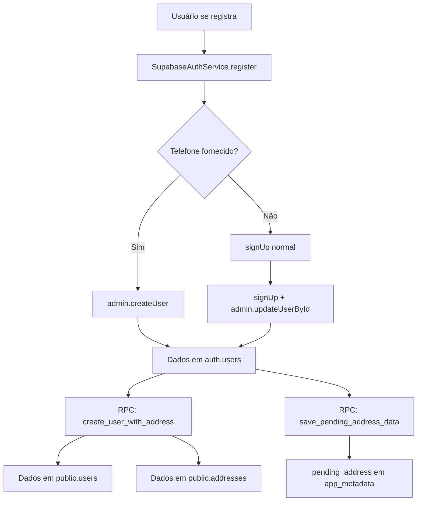
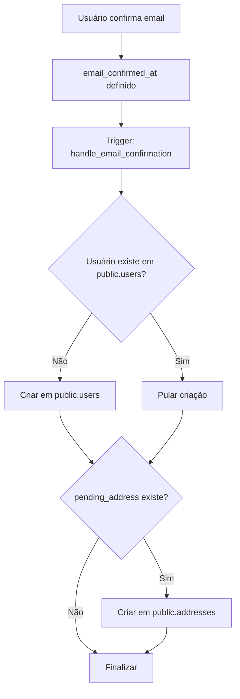

# Estado Atual das Tabelas de Cadastro

## Visão Geral

Este documento detalha o estado atual das tabelas envolvidas no processo de cadastro de usuários no sistema Igreja Oliveira App, incluindo `auth.users`, `public.users` e `public.addresses`.

## Tabelas Envolvidas

### 1. auth.users (Supabase Auth)

**Propósito:** Tabela de autenticação gerenciada pelo Supabase Auth

**Campos Principais:**
- `id` (UUID): Identificador único do usuário
- `email` (TEXT): Email do usuário
- `phone` (TEXT): Telefone do usuário (persistido diretamente)
- `email_confirmed_at` (TIMESTAMP): Data/hora de confirmação do email
- `phone_confirmed_at` (TIMESTAMP): Data/hora de confirmação do telefone
- `raw_user_meta_data` (JSONB): Metadados do usuário
- `raw_app_meta_data` (JSONB): Metadados da aplicação

**Estado Atual (Verificado via MCP):**
```json
{
  "id": "295cc54f-213f-407d-a630-7f0a63016188",
  "email": "jonh.dev.br+test.1755925561631.sgx14@gmail.com",
  "phone": "55995616314954",
  "email_confirmed_at": null,
  "user_meta_full_name": "Test User No Cleanup",
  "user_meta_phone": null,
  "user_meta_provider_type": "phone",
  "app_meta_provider_type": "phone",
  "pending_address": null
}
```

**Observações:**
- ✅ Telefone persistido corretamente no campo `phone`
- ✅ `provider_type` definido como 'phone' (Supabase sobrescreve 'email' quando telefone presente)
- ❌ Email não confirmado (`email_confirmed_at` = null)
- ❌ Sem dados de endereço pendente

### 2. public.users

**Propósito:** Tabela de perfil de usuário da aplicação

**Campos Principais:**
- `id` (UUID): Referência para `auth.users.id`
- `email` (TEXT): Email do usuário
- `full_name` (TEXT): Nome completo
- `phone` (TEXT): Telefone do usuário
- `country_code` (TEXT): Código do país (padrão: '+55')
- `role` (TEXT): Papel do usuário (padrão: 'member')
- `created_at` (TIMESTAMP): Data de criação
- `updated_at` (TIMESTAMP): Data de atualização

**Estado Atual:**
- ❌ **VAZIO** - Nenhum registro encontrado
- **Motivo:** Usuários de teste não confirmaram email
- **Impacto:** Dados não migram de `auth.users` para `public.users`

### 3. public.addresses

**Propósito:** Tabela de endereços dos usuários

**Campos Principais:**
- `id` (UUID): Identificador único do endereço
- `user_id` (UUID): Referência para `public.users.id`
- `street` (TEXT): Rua
- `number` (TEXT): Número
- `neighborhood` (TEXT): Bairro
- `city` (TEXT): Cidade
- `state` (TEXT): Estado
- `zip_code` (TEXT): CEP
- `country` (TEXT): País (padrão: 'Brasil')
- `is_default` (BOOLEAN): Endereço padrão

**Estado Atual:**
- ❌ **VAZIO** - Nenhum registro encontrado
- **Motivo:** Dependente de registros em `public.users`
- **Impacto:** Endereços não são criados sem confirmação de email

## Fluxo de Dados Atual

### 1. Registro Inicial


### 2. Confirmação de Email


## Problemas Identificados

### 1. Fluxo Duplo de Criação

**Problema:** O sistema executa duas estratégias de criação:
- **Imediata:** Via RPC `create_user_with_address` (linha 189-245 do SupabaseAuthService)
- **Trigger:** Via `handle_email_confirmation` na confirmação de email

**Impacto:**
- Possível duplicação de dados
- Conflitos de inserção
- Lógica complexa e difícil de manter

**Evidência:**
```typescript
// Criação imediata (SupabaseAuthService.ts:189-245)
await supabaseAdmin.rpc('create_user_with_address', {
  p_user_id: data.user.id,
  p_email: data.user.email,
  p_full_name: fullName,
  p_phone: phone || null,
  p_address: addressData || null
});

// E também salva para o trigger
await supabaseAdmin.rpc('save_pending_address_data', {
  user_id: data.user.id,
  address_data: addressData
});
```

### 2. Dependência de Confirmação de Email

**Problema:** Dados só aparecem em tabelas públicas após confirmação de email

**Impacto:**
- Usuários não confirmados não têm perfil completo
- Dificuldade para rastrear usuários pendentes
- Experiência do usuário prejudicada

### 3. Provider Type Inconsistente

**Problema:** Código define `provider_type: 'email'` mas Supabase sobrescreve para 'phone'

**Impacto:**
- Documentação/testes não refletem comportamento real
- Confusão sobre fonte de verdade
- Possíveis bugs em lógica que depende do provider_type

## Recomendações

### 1. Simplificar Fluxo de Criação

**Opção A - Apenas Criação Imediata:**
- Remover trigger `handle_email_confirmation`
- Manter apenas RPC `create_user_with_address`
- Criar dados imediatamente no registro

**Opção B - Apenas Trigger:**
- Remover criação imediata do SupabaseAuthService
- Manter apenas trigger na confirmação
- Aceitar que dados só existem após confirmação

### 2. Melhorar Rastreamento

- Adicionar campo `email_confirmed` em `public.users`
- Criar view que une `auth.users` e `public.users`
- Implementar dashboard de usuários pendentes

### 3. Corrigir Documentação

- Atualizar testes para refletir `provider_type: 'phone'`
- Documentar comportamento do Supabase
- Criar guia de troubleshooting

## Próximos Passos

1. [ ] Decidir estratégia de criação (imediata vs trigger)
2. [ ] Implementar correções no código
3. [ ] Atualizar testes de integração
4. [ ] Criar documentação de fluxo
5. [ ] Validar via testes e MCP

---

**Última atualização:** 2025-01-21  
**Responsável:** Assistente AI  
**Status:** Análise completa, aguardando implementação de correções